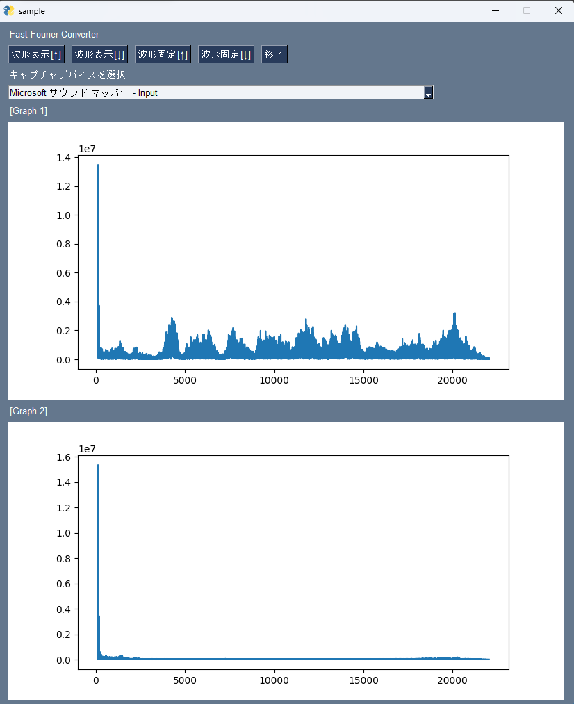

# FFT グラフ 比較実演用ソフトウェア

JSEC 2022 用



## Install

```sh
pip install -r requirement.txt # 依存ライブラリのインストール
```

## Usage

```sh
python window.py
```

## TODO

- ハリボテキャプチャデバイス選びをちゃんと選択できるようにする
- 音声ファイルを再生できるようにする

## Hint

`timeout = 10`

- [【Raspberry Pi】マイク音声をリアルタイムFFT解析を行いグラフに表示する【Python】](https://hellobreak.net/raspberry-pi-sound-fft-realtime/)
- [PySimpleGUIにMatplotlibを埋め込みたい](https://qiita.com/bear_montblanc/items/cce4e8c58dfa236200f6)